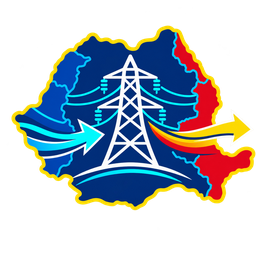

  

<h1 align="center">Energy Romania pentru Home Assistant</h1>

  Integrare independentă pentru monitorizarea fluxurilor fizice de energie dintre 
  România și Ungaria, Serbia, Bulgaria, Ucraina și Republica Moldova.

  
  
  

## Ce ofera

- configurare completa din **Settings -> Devices & Services -> Add Integration**;
- fara token, cont sau configurare YAML;
- import, export si sold net pentru fiecare tara vecina;
- import total, export total si soldul tuturor frontierelor;
- valorile individuale ale liniilor in atributele senzorilor;
- card Lovelace cu harta animata, inregistrat automat in **Add card**;
- actualizare configurabila intre 30 si 3600 secunde;
- logo propriu pentru Home Assistant.

## Instalare prin HACS

1. Adauga ca repository custom:
   `https://github.com/andrexyx/energy-romania`
2. Categoria: **Integration**.
3. Instaleaza si reporneste Home Assistant.
4. Adauga integrarea **Energy Romania** din Devices & Services.
5. In dashboard alege **Add card -> Energy Romania Flow Map**.

Cardul si resursa JavaScript sunt inregistrate automat in modul Lovelace storage.

## Conventia valorilor

- import: energie care intra in Romania, intotdeauna valoare pozitiva;
- export: energie care iese din Romania, intotdeauna valoare pozitiva;
- sold net: pozitiv pentru import net, negativ pentru export net.

Sursa datelor: endpoint-ul public `https://www.transelectrica.ro/sen-filter`.
Proiectul nu este afiliat oficial cu Transelectrica SA.

## Licenta si contributii

Energy Romania este un proiect independent, publicat sub licența MIT și
menținut de `@andrexyx`.
